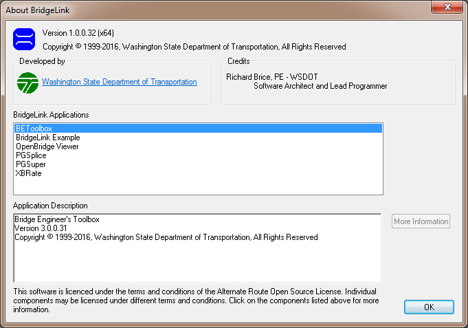
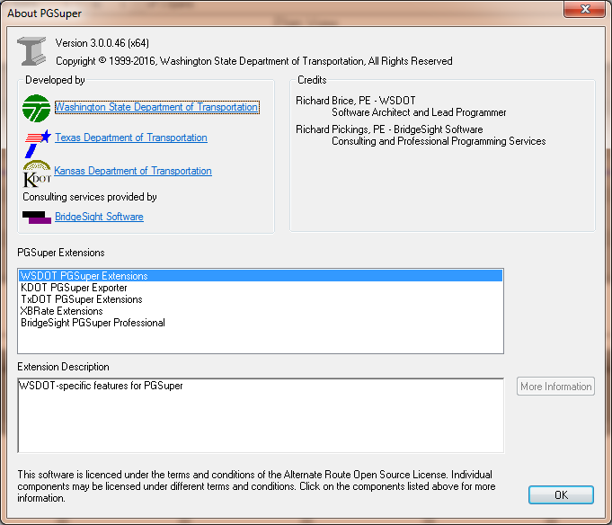

Installed BridgeLink Applications {#installed_applications}
=================================

BridgeLink uses a layered versioning scheme. BridgeLink has its own version number as does each BridgeLink Application. For those applications that are extensible, the extensions will also have version numbers. For example, BridgeLink version 1.0 comes with PGSuper version 3.0 and WSDOT PGSuper Extension version 3.0.

The version numbers associated with each release of BridgeLink is listed in the Release History section for BridgeLink at the WSDOT software web site.

To get the version numbers
1. Select *Help > About BridgeLink*. 
2. In the BridgeLink Applications box, select the name of an application
3. In the Application Description box, you will see the name, version number, and other information about the application. If additional information is available, the 
More Information button will be enabled. Press this button to see the additional information.

To get the version number of the application extensions (we will use PGSuper as an example, however this procedure applies to all extensible applications)
1. Open a project for the application in which you are interested (in our case, PGSuper)
2. Select *Help > About PGSuper*. 
3. In the PGSuper Extensions box, select the name of an extension
4. In the Extension Description box, you will see the name, version number, and other information about the extension. If additional information is available, the More Information button will be enabled. Press this button to see the additional information.
