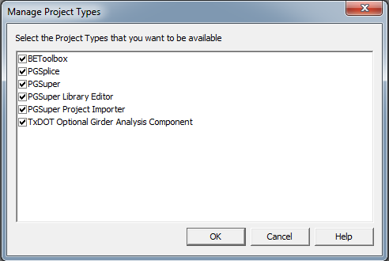

Managing BridgeLink Applications {#managing_applications}
================================
BridgeLink is an extensible application framework. As you probably noticed during the installation process, you can choose to install any or all of the applications. BridgeLink provides a simple mechanism for managing the applications that were installed.

##Managing Project Types
BridgeLink Applications are presented to you as project types in the New Project window. 

The available project types can be managed by enabling the ones you want to see and disabling the rest of them. Disabling a project type will remove it from the list of available project types in the New Project window but will not uninstall it.

To manage project types
1. Select *File > Manage > Project Types*. This will open the Manager Project Types window

2. Check the boxes next to the project types that you want available
3. Press the [OK] button.
