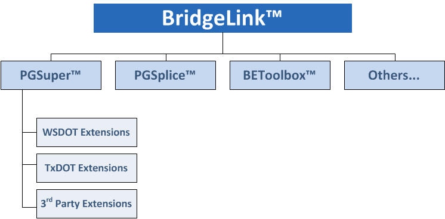

Introduction {#mainpage}
=====================

BridgeLink is an open source bridge engineering application framework from the Washington State Department of Transportation (WSDOT). BridgeLink provides a single cohesive environment that links together bridge engineering software applications. 

BridgeLink really isn't a new application. The BridgeLink application framework has been known as PGSuper for many years. Not that long ago WSDOT added BEToolbox to the framework and Texas Department of Transportation (TxDOT) added TOGA. PGSplice has just been added and future plans include the addition of QConBridge, Barlist, and other new applications. Continuing to call the framework PGSuper makes little sense as the number and variety of applications continue to grow. The long term vision for BridgeLink is to have bridge engineering software and data link together for individual bridge projects, projects consisting of many bridges that are being designed by many engineers, and all the bridges in an owner's inventory.

## Extensible Application Framework
BridgeLink is an extensible application framework. BridgeLink allows a wide variety of applications to link into a consistent and cohesive environment.

### BridgeLink Applications

BridgeLink Applications are software programs that extend the BridgeLink framework. Examples of BridgeLink Applications are PGSuper and PGSplice. BridgeLink can be extended with applications created by anyone, even third party developers offering proprietary applications.

### Application Extensions

In addition to supporting applications that plug into and extend the overall framework, many BridgeLink Applications can themselves be extended.  A familiar example is PGSuper. The Washington and Texas agency specific features in PGSuper are not actually part of PGSuper itself, but are extensions to the application. If the WSDOT and TxDOT extensions are disabled, the agency specific features are not available and do not appear in the user interface. 

Another example is PGSuper Professional. [BridgeSight Inc](http://www.bridgesight.com). has developed third party extensions to PGSuper. These extensions are proprietary products and bring new and unique capabilities into the software. The extended capabilities offered by BridgeSight include a Girder Design Dashboard, 3D visualization, import and export of alignment data with LandXML, exporting of analysis results to Microsoft Excel, and more.

Figure 1 illustrates the relationship between BridgeLink, BridgeLink Applications, and Application Extensions.

